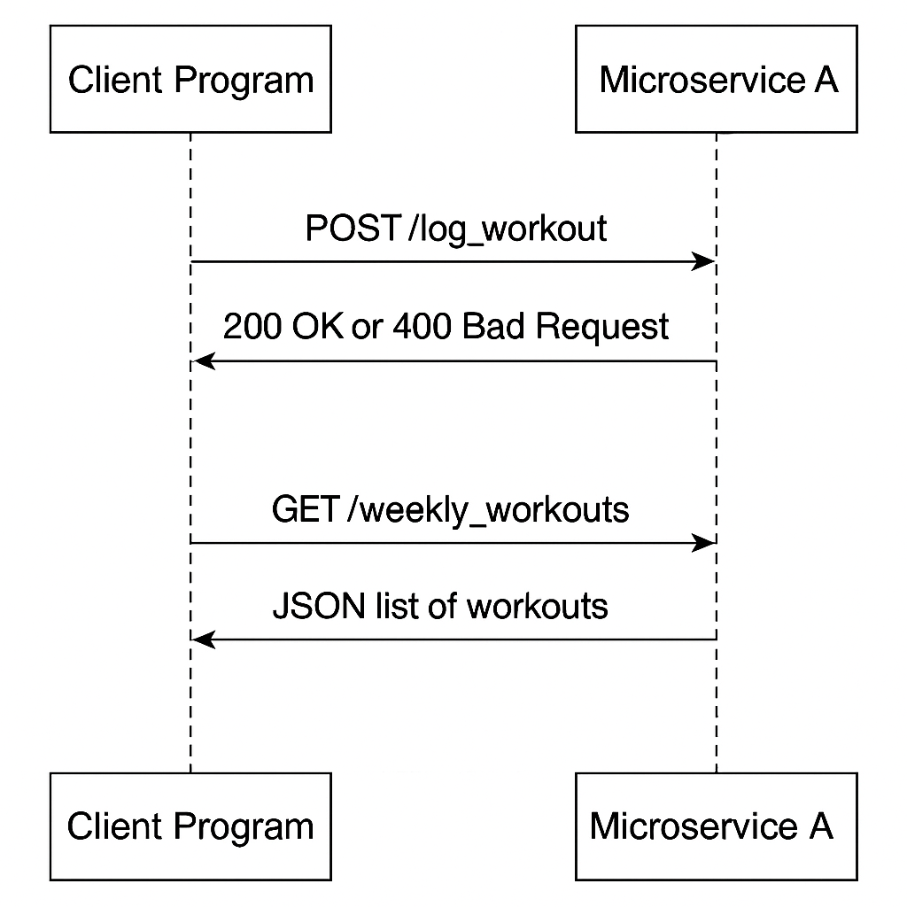

  # 🏋️ Fitness Tracker – Microservice A

  This microservice allows users to log workouts and retrieve workouts done in the current week. It is implemented using Flask and is part of a larger microservices-based fitness application.

  ---

  ## 📜 Communication Contract
  This document outlines how another program(the main program) can communicate with the microservice.The contract is stable and can be relied upon for integration

  ### A. How to REQUEST data from this microservice

  To request weekly workouts:

  ```python
  import requests

  response = requests.get("http://127.0.0.1:5000/weekly_workouts")
  print(response.json())
  ```

  To log a workout:

  ```python
  import requests

  data = {
      "name": "Push-ups",
      "date": "08/06/2025",
      "duration": 20
  }

  response = requests.post("http://127.0.0.1:5000/log_workout", json=data)
  print(response.json())
  ```

  ---

  ### B. How to RECEIVE data from this microservice

  The microservice responds with JSON data. Example:

  ```json
  [
    {
      "name": "Push-ups",
      "date": "08/06/2025",
      "duration": 20
    }
  ]
  ```

  Use `.json()` in Python requests to receive and parse the data:

  ```python
  workouts = response.json()
  for workout in workouts:
      print(workout["name"], workout["duration"])
  ```

  ---

  ### C. UML Sequence Diagram

  See `uml_sequence.png` in the repo.

  

  This diagram illustrates:
  - How the client sends a POST request to `/log_workout`
  - How the microservice processes and stores the data
  - How the client requests weekly data via `/weekly_workouts`

  ---

  ## 🔧 Running the Microservice

  ```bash
  pip install flask
  python microservice_a.py
  ```

  Accessible locally at:
  **http://127.0.0.1:5000**

  ---

  ## 🧪 Test Program

  Run:

  ```bash
  python test_microservice.py
  ```

  This sends test requests and displays received responses.

  ---

  ## 📁 Repo Contents

  - `microservice_a.py` – The main Flask app
  - `test_microservice.py` – Test client for the API
  - `uml_sequence.png` – UML sequence diagram
  - `README.md` – This file
  - `mitigation_plan.md` – Backup and communication plan

  ---

  ## 🤝 Teammate Name

  Implemented for: **[Insert Teammate Name]**
